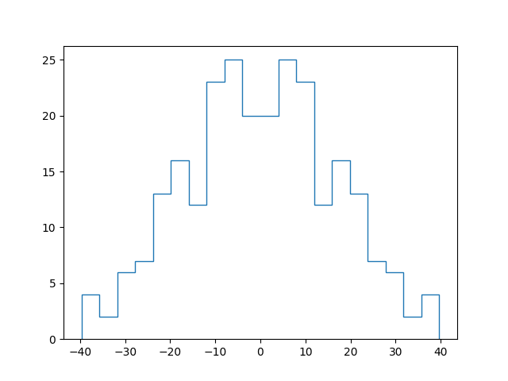
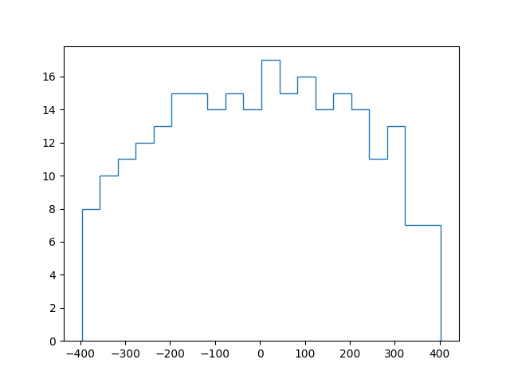
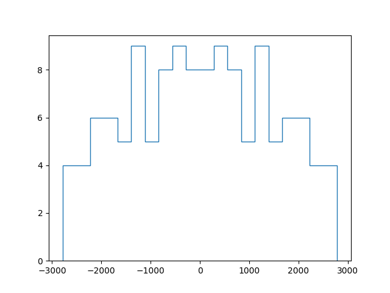
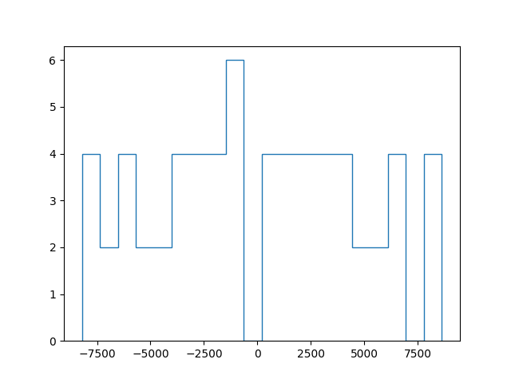
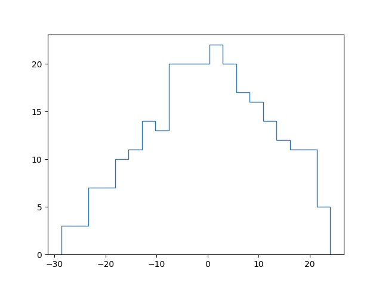

### NOTE: Read the Log too. Current progress and other issues are adderssed there 
### NOTE: The code is much faster with all pssible combinations instead fo all possible permutations. 
###        Feel free to download and play around for various values
# The SYK Model
The SYK model is given by the Hamiltonian

where the J's are Random numbers picked from a gaussian distribution, with mean = 0 and std_dev = J
For all the below distributions J = 1
# Single Free SYK for N=16 , q = 2

# Single Free SYK for N=16 , q = 4

# Single Free SYK for N=14 , q = 6

# Single Free SYK for N=12 , q = 8
q = 8 is pretty weird, but this is a result of using low, N. 
It had similar structure for q=4 too for N=12. 

# Coupled SYK N=8  

